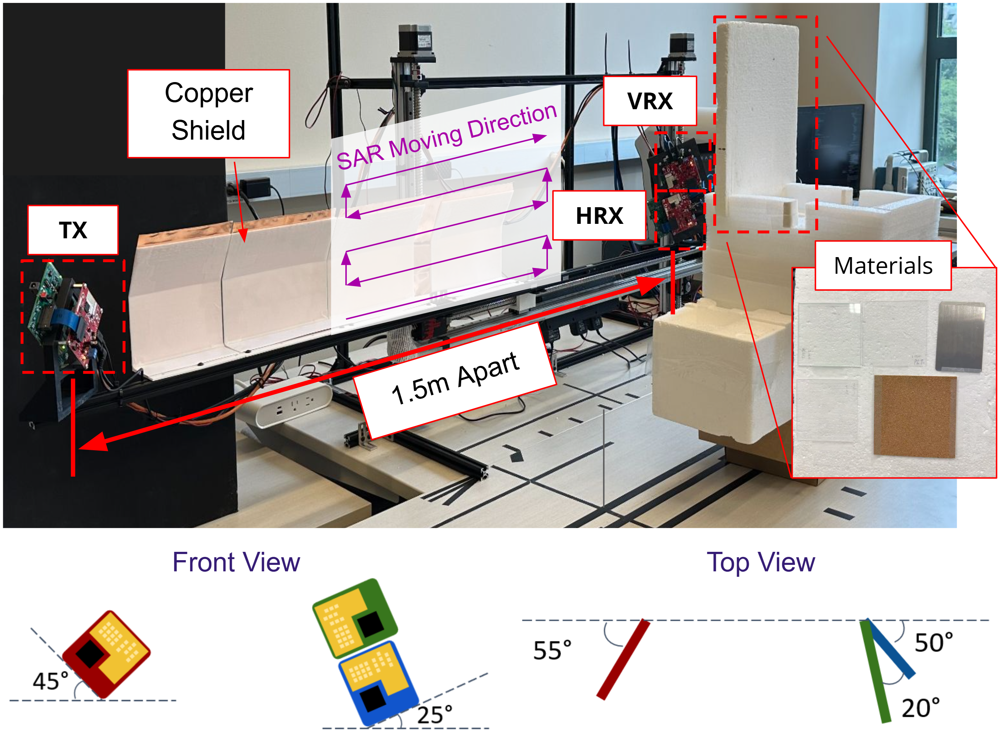

<h1 align="center">POLySight</h1>

<h3 align="center">Towards Practical Bi-Static Polarimetric Imaging Using Commodity mmWave Radars for Material Sensing</h3>

<p align="center"><i>ACM/IEEE SenSys 2026</i></p>

<p align="center">
  <a href="https://xsun2445.github.io/polysight/">Project Page</a> |
  <a href="https://huggingface.co/datasets/xinghs/polysight">Dataset (Hugging Face)</a>
</p>

<p align="center">
  
</p>

Polarimetric bistatic SAR imaging system for contactless material characterization at 77 GHz.

A single TX board (TI AWR2243) illuminates the scene while two spatially separated RX boards capture orthogonal polarizations (H, V). A 2-D motorized raster stage synthesizes a large aperture. The polarimetric ratio H/V, combined with Fresnel reflection inversion, yields complex permittivity (ε′ − jε″) of materials without physical contact.


<p align="center">
  
</p>


## Setup

```bash
uv venv
uv pip install -r requirements.txt
```

GPU acceleration (SAR generation) requires CUDA 12.x and CuPy.

## Pipeline

```
Collection → Decode/Sync → SAR Generation → Labeling → Permittivity Extraction
(collect.py)   (decode.py)   (sar.py + GPU)   (notebook)   (Fresnel inversion)
```

Detailed tutorials/implementations are inside the notebooks folder:
1. [Synchronization](notebooks/01_synchronization.ipynb)
2. [SAR generation](notebooks/02_sar_generation.ipynb)
3. [Liquid materials](notebooks/03_eval_liquids.ipynb)
4. [Solid and powder materials](notebooks/04_eval_solids.ipynb)
5. [Case study on sugar water concentration](notebooks/05_concentration.ipynb)

## Method

1. **Bistatic geometry**: TX and RX separated ~1.5 m, incidence angle 55°–60°
2. **Polarimetric ratio**: `div = SAR_H / SAR_V` (complex-valued)
3. **Amplitude → Fresnel ratio**: Normalize against metal reference, correct for antenna axial ratio, compute `p = tan(θ_pol)`
4. **Phase → loss tangent**: Extract referenced phase from H/V ratio
5. **Complex Fresnel ratio**: `p_complex = |p| · exp(−jφ)`
6. **Inversion**: `ε = (1 + 4p/(1−p)² · sin²θ_i) · tan²θ_i`
7. **Result**: `ε′ = Re(ε)`, `ε″ = |Im(ε)|`


## Dataset

The dataset contains 70 synchronized radar collections across 36 materials including plastics, ceramics, glass, wood, rubber, metals, liquids, and powders, measured at 55° and 60° incidence angles.

| Folder       | Size    | Contents                                  |
|--------------|---------|-------------------------------------------|
| `raw/`       | ~72 GB  | 70 synchronized radar cubes (~1 GB each)  |
| `labels/`    | ~66 MB  | 84 SAR image collections with labels      |
| `materials/` | ~1 MB   | 72 cropped material sample files (.pkl)   |
| `unsynced/`  | ~35 GB  | 2 example raw unsynchronized ADC captures |

See [data/README.md](data/README.md) for more details and selective downloading.

## Hardware

See [hardware/README.md](hardware/README.md) for more details

- **Radar**: 3 sets of TI AWR2243 FMCW (76–81 GHz) + DCA1000 EVM (ADC capture). Currently requires 3 PCs to config and re-trigger each of the radar with TI mmWaveStudio. todo: command line tool to replace the mmWaveStudio. A similar setup can be found in our MulDar repo: https://github.com/xsun2445/MulDar
- **Synchronization**: Raspberry Pi 4B
- **Motion stage**: 2-axis linear stage, 3 stepper motors + drivers, Arduino-controlled stepper motors

For more details please check out our paper: https://xsun2445.github.io/assets/pdf/Sensys_2026_PolySight.pdf

## Citation

```bibtex
@inproceedings{sun2026towards,
  title={Towards Practical Bi-Static Polarimetric Imaging Using Commodity mmWave Radars for Material Sensing},
  author={Sun, Xinghua and Gadre, Akshay},
  booktitle={Proceedings of the 2026 ACM/IEEE International Conference on Embedded Artificial Intelligence and Sensing Systems},
  pages={172--185},
  year={2026}
}
```

